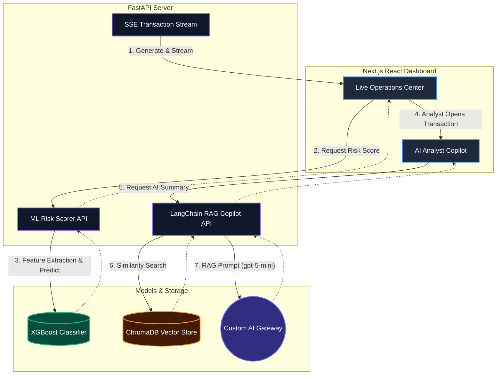

# AI Scam Shield 🛡️

**AI-powered real-time fraud prevention for instant payments (FedNow / RTP)**

Built for modern fraud operations — featuring **XGBoost ML** for live scoring and **LangChain RAG** + **OpenAI** for Analyst Copilot explainability.

---

## 🏗️ Architecture Flow



## 🧠 Technology Stack

### Core Engine
| Component | Technology | Description |
|---|---|---|
| **ML Model** | XGBoost (`xgboost`) | Real-time transaction scoring trained on Kaggle PaySim data. |
| **LLM** | OpenAI `gpt-5-mini` | Powers the Analyst Copilot and Chat. Routed via custom AI Gateway. |
| **Embeddings** | OpenAI `text-embedding-3-small` | Vectorizes the internal knowledge base documents. |
| **Vector Store** | ChromaDB | Persistent local database storing 57 RAG knowledge chunks. |
| **RAG Framework**| LangChain LCEL | Orchestrates `RetrievalQA` and `ConversationalRetrievalChain`. |

### Infrastructure
| Layer | Tech |
|---|---|
| **Frontend** | Next.js 16, Tailwind CSS, Lucide Icons |
| **Backend** | FastAPI, Uvicorn, Pydantic |
| **Streaming** | Server-Sent Events (SSE) |

---

## 🚀 Setup & Installation

### 1. Start the Backend
```bash
cd backend
pip install -r requirements.txt
python -m uvicorn main:app --reload --port 8000
```
*On the first run, ChromaDB will automatically embed the 5 knowledge base documents.*

### 2. Start the Frontend
```bash
cd frontend
npm install
npm run dev
```
Open **http://localhost:3000**

---

## 🔍 Key Features

- **Live SSE Stream** — Mock transaction generator streaming real-world PaySim fraud patterns.
- **XGBoost Scoring Engine** — Transactions are scored instantly using on-the-fly feature engineering.
- **LangChain RAG Copilot** — Retrieves FinCEN/FedNow rules, fraud patterns, and case studies before generating an explanation.
- **RAG Context Viewer** — See exactly which documents the AI used for its conclusion.
- **Multi-turn Analyst Chat** — Conversational AI with memory to drill down into a transaction.
- **Interactive Triage Queue** — Dynamic alerts for Critical-tier transactions.

---

## 📡 API Endpoints

| Method | URL | Description |
|---|---|---|
| GET | `/health` | Backend, ML Model, and RAG status |
| GET | `/transactions` | SSE stream of synthetic transactions |
| POST | `/score_risk` | XGBoost ML risk score & feature importances |
| POST | `/copilot_summary` | LangChain RAG AI explainability |
| POST | `/analyst_chat` | Multi-turn conversational AI |
| DELETE | `/analyst_chat/{session_id}` | Clear chat memory |
